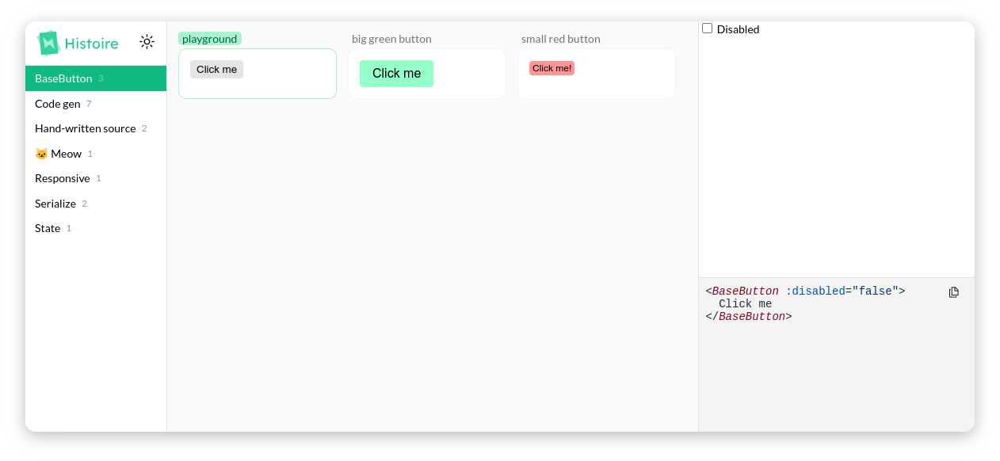

  

 

# Histoire

> Fast and beautiful interactive component playgrounds

[Read the Documentation](https://histoire.dev) |
[Discord server](https://discord.gg/KpCnT72rJk) | [Discussions board](https://github.com/histoire-dev/histoire/discussions)

⚡️ Lightning fast development and instant HMR thanks to [Vite](http://vitejs.dev)
👓 Build and visually test your components in isolation
📚 Document your components with stories and variants
📝 Generate source code examples automatically
🎨 Beautiful and customizable interface

## Continuous Releases

You can install builds from any commit on the main branch from [here](https://nightly.akryum.dev/histoire-dev/histoire) or from any Pull Request.

## Contributing

See [Contributing Guide](https://github.com/Akryum/histoire/blob/main/CONTRIBUTING.md) to learn more about the repository and how you can contribute.

## Sponsors

Become a sponsor!

- [Guillaume Chau](https://github.com/sponsors/Akryum)
- [Hugo Attal](https://github.com/sponsors/hugoattal)

We are very grateful to all our sponsors for their support:

### [Guillaume Chau](https://github.com/sponsors/Akryum)

  

## License

MIT
